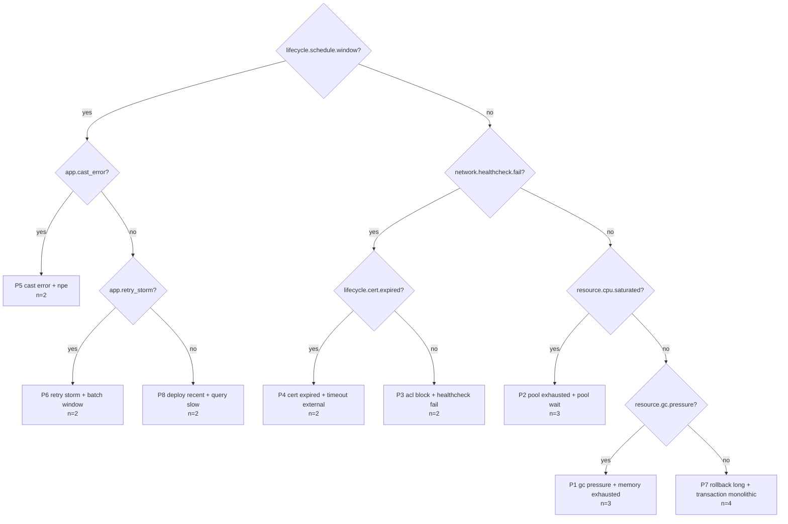

# postmortem-miner

[](https://github.com/JulianoVinceCampos/postmortem-miner/actions/workflows/pr-ci.yml)
[](https://sonarcloud.io/summary/new_code?id=JulianoVinceCampos_postmortem-miner)
[](https://sonarcloud.io/summary/new_code?id=JulianoVinceCampos_postmortem-miner)
[](https://scorecard.dev/viewer/?uri=github.com/JulianoVinceCampos/postmortem-miner)
[](LICENSE)

**Your postmortems already know what keeps breaking. This reads them back to you as a
triage decision tree.**

On the bundled synthetic corpus:

> **8 patterns explain 90% of 20 incidents, in 17 ms, with a triage depth of 4.**

Four questions to classify a live incident against everything the archive has seen before.
The remaining 10% are two one-off incidents that genuinely do not belong to a pattern, and
the tool says so instead of inventing one.

## Why

Teams write good postmortems and then never read them as a set. Each one is a story about
one night. Read together, twenty of them are a map: the same four or five failure modes,
each with a distinctive signature, most with a root cause nobody has had time to fix.

That map is what you actually want at minute three of an incident, and building it by hand
takes an afternoon nobody has. So: automate the reading, keep the reasoning explainable,
and let the tool tell you when it does not know.

## Quickstart

```bash
git clone https://github.com/JulianoVinceCampos/postmortem-miner
cd postmortem-miner
make report        # generates the corpus and reproduces the number above
```

No dependencies to install for that: the package uses the standard library only
([ADR-0001](docs/adr/ADR-0001-zero-runtime-dependencies.md)). Python 3.11+.

Without `make`:

```bash
python3 tools/gen_corpus.py --out corpus --count 18 --seed 7
PYTHONPATH=src python3 -m postmortem_miner.cli mine corpus --out out/report.md
```

Against your own archive:

```bash
python -m postmortem_miner.cli mine path/to/postmortems --out report.md --json analysis.json
```

Mid-incident, with the signals you are looking at right now:

```bash
python -m postmortem_miner.cli classify path/to/postmortems \
  --signals saturation.pool.exhausted,store.lock.contention
# -> P2 pool exhausted + pool wait
```

`postmortem-miner signals` lists every token it can recognise.

## What the tree looks like

Generated from the synthetic corpus, rendered straight into the report:



The report also carries a signal-by-pattern support matrix, the evidence snippet behind
every classification, and a count of how many occurrences of each pattern still have an
untreated root cause. That last column is usually the uncomfortable one.

## How it works

```
markdown ──▶ Incident ──▶ signal tokens ──▶ patterns ──▶ decision tree ──▶ report
             parser        signals           patterns     decision_tree     report
```

**Parsing** is deliberately forgiving. Frontmatter is optional, field names are accepted in
English and Portuguese, and the date is recovered from frontmatter, filename or body. A
parser that skips a postmortem over a field name is a parser nobody runs.

**Signal extraction** maps prose to canonical tokens such as `saturation.pool.exhausted`
through a curated, bilingual regex table: 31 tokens across 8 layers, each carrying the
snippet of text that produced it. Not embeddings, and
[ADR-0002](docs/adr/ADR-0002-regex-rules-not-embeddings.md) argues why at length. The short
version: at 3am you need a conclusion you can argue with, not a similarity score you have
to trust.

**Clustering** is single-linkage over Jaccard similarity of signal sets. K is unknown in
advance, and a chain of related incidents should be allowed to join without forcing a
centroid that means nothing operationally.

**Distinctive signals** are the interesting output, not the clusters. A signal present in
every incident in the corpus is background noise; one that is frequent inside a pattern and
rare outside it is a triage question. The margin requirement is what makes the difference.

**The tree** is greedy information gain, depth-capped at 4. Deeper trees score better and
help nobody: no one walks nine questions while production is down.

Everything is deterministic. Same corpus, same bytes out - which is what lets CI defend the
number in this README instead of trusting that someone updated it.

## Signal taxonomy

| Layer | Example tokens |
|---|---|
| `resource` | `cpu.saturated`, `memory.exhausted`, `gc.pressure`, `disk.pressure` |
| `saturation` | `pool.exhausted`, `pool.wait`, `threads`, `queue.backlog` |
| `store` | `lock.contention`, `rollback.long`, `query.slow`, `transaction.monolithic` |
| `network` | `acl.block`, `lb.imbalance`, `healthcheck.fail`, `timeout.external` |
| `application` | `npe`, `cast_error`, `batch_error`, `retry_storm`, `error_swallowed`, `callback_missing` |
| `lifecycle` | `deploy.recent`, `cert.expired`, `schedule.window`, `restart.reactive` |
| `workload` | `traffic.spike`, `payload.large`, `batch.window` |
| `topology` | `single_node`, `all_nodes` |

Adding a rule is one line plus a fixture. See [CONTRIBUTING](CONTRIBUTING.md) - it is the
most useful contribution you can make.

## The corpus is synthetic, on purpose

The bundled corpus is generated by `tools/gen_corpus.py`: 8 incident families plus two
one-off incidents that deliberately refuse to cluster, half in English and half in
Portuguese, deterministic for a given seed.

The failure modes are realistic because they are common to any JVM-plus-relational-database
stack behind a load balancer. Nothing in it comes from a real system, customer or colleague.
That is enforced, not promised: `tools/sanitize_scan.py` blocks instance ids, account ids,
tax ids, private addresses and internal hostnames, and it is the **first** job in CI -
before linting - because a leak in a public git history is the one mistake here that cannot
be undone. The test suite asserts that the gate passes on this repository with no waiver.

## What it does not do yet

- **Derive candidate SLIs from incident history.** The interesting next step: the archive
  already implies which indicators would have predicted each pattern. Planned for 0.2.
- **Feedback loop.** Classifying a live incident should be able to append it to the corpus.
- **Anything at write scale.** Clustering is O(n²); fine to a few thousand postmortems.

## Development

```bash
make install   # dev extras plus pre-commit hooks
make check     # sanitize + lint + tests, in CI order
make cov       # coverage plus the ratchet
```

The pipeline runs ten layers: pre-commit, sanitize, lint, build and test across three
Python versions, coverage with a ratchet that only moves up, Semgrep, CodeQL as a blocking
check, dependency review with OSV, the SonarCloud quality gate, and SBOM plus build
provenance attestation.

## License

MIT. See [LICENSE](LICENSE).
