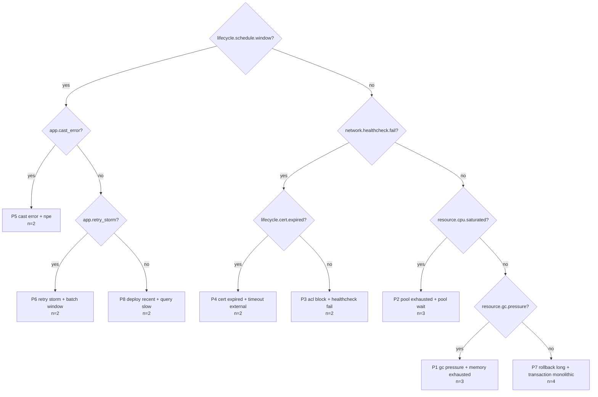

# postmortem-miner

[](https://github.com/JulianoVinceCampos/postmortem-miner/actions/workflows/pr-ci.yml)
[](https://sonarcloud.io/summary/new_code?id=JulianoVinceCampos_postmortem-miner)
[](https://sonarcloud.io/summary/new_code?id=JulianoVinceCampos_postmortem-miner)
[](https://scorecard.dev/viewer/?uri=github.com/JulianoVinceCampos/postmortem-miner)
[](LICENSE)

**[Demo ao vivo](https://postmortem-miner.onrender.com)** — entra com `demo` / `demo`.
Instância pública sobre o corpus sintético, somente leitura. Pode levar alguns segundos
para responder se estiver hibernando.

**Seus postmortems já sabem o que vive quebrando. Esta ferramenta os lê de volta pra você
como uma árvore de decisão de triagem.**

No corpus sintético que acompanha o projeto:

> **8 padrões explicam 90% de 20 incidentes, em 17 ms, com uma profundidade de triagem de 4.**

Quatro perguntas para classificar um incidente ao vivo contra tudo o que o arquivo já viu.
Os 10% restantes são dois incidentes pontuais (one-off) que genuinamente não pertencem a
nenhum padrão — e a ferramenta diz isso, em vez de inventar um.

## Por quê

Times escrevem bons postmortems e depois nunca os leem como um conjunto. Cada um é a
história de uma noite. Lidos juntos, vinte deles viram um mapa: os mesmos quatro ou cinco
failure modes, cada um com uma assinatura distinta, a maioria com uma root cause que ninguém
teve tempo de corrigir.

Esse mapa é exatamente o que você quer no minuto três de um incidente, e construí-lo à mão
leva uma tarde que ninguém tem. Então: automatize a leitura, mantenha o raciocínio explicável
(explainable) e deixe a ferramenta te dizer quando ela não sabe.

## Início rápido

```bash
git clone https://github.com/JulianoVinceCampos/postmortem-miner
cd postmortem-miner
make report        # gera o corpus e reproduz o número acima
```

Nada a instalar para isso: o pacote usa apenas a biblioteca padrão (standard library)
([ADR-0001](docs/adr/ADR-0001-zero-runtime-dependencies.md)). Python 3.11+.

Sem `make`:

```bash
python3 tools/gen_corpus.py --out corpus --count 18 --seed 7
PYTHONPATH=src python3 -m postmortem_miner.cli mine corpus --out out/report.md
```

Contra o seu próprio arquivo:

```bash
python -m postmortem_miner.cli mine path/to/postmortems --out report.md --json analysis.json
```

No meio de um incidente, com os sinais que você está olhando agora:

```bash
python -m postmortem_miner.cli classify path/to/postmortems \
  --signals saturation.pool.exhausted,store.lock.contention
# -> P2 pool exhausted + pool wait
```

`postmortem-miner signals` lista todos os tokens que ele consegue reconhecer.

## Dashboard

O markdown responde bem "o que este acervo diz". Responde mal "e este incidente aqui,
agora?". Para isso existe uma tela:

```bash
python -m postmortem_miner.cli serve corpus        # http://127.0.0.1:8000
```

Sete views, na ordem em que a pergunta aparece: visão geral com a distribuição dos
padrões e das camadas de sinal, a árvore de triagem navegável, **classificar incidente**
(marque os sinais que está vendo e receba o padrão provável junto do caminho percorrido),
padrões em detalhe com evidência e status da causa raiz, a matriz sinal × padrão, o
diretório de incidentes com os sinais extraídos e o trecho que os originou, a taxonomia
completa, e o relatório — que é literalmente a saída de `mine`, não uma segunda fonte de
verdade.

Credencial do portão de demonstração: `demo` / `demo`, sobrescrevível por `PM_USER` e
`PM_PASSWORD`. A verificação acontece no servidor, com cookie assinado por HMAC. É um
portão de demonstração sobre dado sintético e somente leitura, não um controle de
segurança — mas um portão validado no navegador não seria portão nenhum.

**Continua sem dependência de runtime.** O servidor é `http.server`, a sessão é `hmac`, o
frontend não tem framework nem CDN e os gráficos são SVG gerado na hora.
[ADR-0003](docs/adr/ADR-0003-web-dashboard-on-stdlib.md) revisita o ADR-0001 e explica por
que FastAPI ficou de fora.

## Container e deploy

```bash
docker compose up --build      # http://127.0.0.1:8000
```

A imagem não tem etapa de resolução de dependência, porque não há dependência a resolver.
Roda como usuário não-root e traz `HEALTHCHECK` batendo em `/api/health`.

A instância pública roda em [postmortem-miner.onrender.com](https://postmortem-miner.onrender.com), criada a partir do
blueprint de Render (`render.yaml`) que acompanha o repositório, com auto-deploy no push. A
porta não está fixada em lugar nenhum: a plataforma injeta `PORT` e o default da CLI lê do
ambiente.

Monte o seu próprio acervo sobre `/app/corpus` para analisar postmortems de verdade — o
volume é somente leitura, a ferramenta nunca escreve no corpus.

## Como a árvore se parece

Gerada a partir do corpus sintético, renderizada direto no relatório:



O relatório também traz uma matriz de suporte sinal-por-padrão (signal-by-pattern support
matrix), o trecho de evidência (evidence snippet) por trás de cada classificação, e uma
contagem de quantas ocorrências de cada padrão ainda têm uma root cause não tratada. Essa
última coluna costuma ser a desconfortável.

## Como funciona

```
markdown ──▶ Incident ──▶ signal tokens ──▶ patterns ──▶ decision tree ──▶ report
             parser        signals           patterns     decision_tree     report
```

**Parsing** é deliberadamente tolerante. O frontmatter é opcional, nomes de campos são
aceitos em inglês e português, e a data é recuperada do frontmatter, do nome do arquivo ou do
corpo. Um parser que descarta um postmortem por causa de um nome de campo é um parser que
ninguém roda.

**Extração de sinais** mapeia o texto corrido para tokens canônicos como
`saturation.pool.exhausted` através de uma tabela de regex curada e bilíngue: 31 tokens
distribuídos em 8 camadas, cada um carregando o trecho (snippet) de texto que o produziu. Não
são embeddings, e o [ADR-0002](docs/adr/ADR-0002-regex-rules-not-embeddings.md) argumenta
longamente o porquê. A versão curta: às 3 da manhã você precisa de uma conclusão com a qual
possa discutir, não de um similarity score no qual você tem que confiar.

**Clustering** é single-linkage sobre a similaridade de Jaccard dos conjuntos de sinais. O K
é desconhecido de antemão, e uma cadeia de incidentes relacionados deve poder se juntar sem
forçar um centroide que não significa nada operacionalmente.

**Sinais distintivos** são a saída interessante, não os clusters. Um sinal presente em todos
os incidentes do corpus é ruído de fundo (background noise); um que é frequente dentro de um
padrão e raro fora dele é uma pergunta de triagem. O requisito de margem (margin) é o que faz
a diferença.

**A árvore** é information gain guloso (greedy), com profundidade limitada a 4. Árvores mais
profundas pontuam melhor e não ajudam ninguém: ninguém percorre nove perguntas com a produção
fora do ar.

Tudo é determinístico. Mesmo corpus, os mesmos bytes na saída — é isso que permite ao CI
defender o número deste README, em vez de confiar que alguém o atualizou.

## Taxonomia de sinais

| Camada | Tokens de exemplo |
|---|---|
| `resource` | `cpu.saturated`, `memory.exhausted`, `gc.pressure`, `disk.pressure` |
| `saturation` | `pool.exhausted`, `pool.wait`, `threads`, `queue.backlog` |
| `store` | `lock.contention`, `rollback.long`, `query.slow`, `transaction.monolithic` |
| `network` | `acl.block`, `lb.imbalance`, `healthcheck.fail`, `timeout.external` |
| `application` | `npe`, `cast_error`, `batch_error`, `retry_storm`, `error_swallowed`, `callback_missing` |
| `lifecycle` | `deploy.recent`, `cert.expired`, `schedule.window`, `restart.reactive` |
| `workload` | `traffic.spike`, `payload.large`, `batch.window` |
| `topology` | `single_node`, `all_nodes` |

Adicionar uma regra é uma linha mais uma fixture. Veja [CONTRIBUTING](CONTRIBUTING.md) — é a
contribuição mais útil que você pode fazer.

## O corpus é sintético, de propósito

O corpus que acompanha o projeto é gerado por `tools/gen_corpus.py`: 8 famílias de incidentes
mais dois incidentes pontuais (one-off) que deliberadamente se recusam a formar cluster,
metade em inglês e metade em português, determinístico para um dado seed.

Os failure modes são realistas porque são comuns a qualquer stack JVM-mais-banco-relacional
atrás de um load balancer. Nada aqui vem de um sistema, cliente ou colega real. Isso é imposto
(enforced), não prometido: `tools/sanitize_scan.py` bloqueia instance ids, account ids, tax
ids, endereços privados e hostnames internos, e é o **primeiro** job no CI — antes do linting
— porque um vazamento no histórico público do git é o único erro aqui que não dá para desfazer.
A suíte de testes garante que o gate passa neste repositório sem nenhum waiver.

## O que ainda não faz

- **Derivar SLIs candidatas a partir do histórico de incidentes.** O próximo passo
  interessante: o arquivo já implica quais indicadores teriam previsto cada padrão. Planejado
  para a 0.2.
- **Feedback loop.** Classificar um incidente ao vivo deveria permitir anexá-lo ao corpus.
- **Qualquer coisa em escala de escrita.** O clustering é O(n²); ok até alguns milhares de
  postmortems.

## Desenvolvimento

```bash
make install   # extras de dev mais hooks de pre-commit
make check     # sanitize + lint + testes, na ordem do CI
make cov       # coverage mais o ratchet
```

O pipeline roda dez camadas: pre-commit, sanitize, lint, build e testes em três versões do
Python, coverage com um ratchet que só sobe, Semgrep, CodeQL como blocking check, dependency
review com OSV, o quality gate do SonarCloud, e atestação de SBOM mais build provenance.

## Documentação

| Documento | Conteúdo |
| --- | --- |
| [componentes.md](docs/componentes.md) | Os componentes, um diagrama, e o que cada aresta garante |
| [ADR-0001](docs/adr/ADR-0001-zero-runtime-dependencies.md) | Por que zero dependência de runtime |
| [ADR-0002](docs/adr/ADR-0002-regex-rules-not-embeddings.md) | Por que regras de regex e não embeddings |
| [ADR-0003](docs/adr/ADR-0003-web-dashboard-on-stdlib.md) | Por que o dashboard também é stdlib |
| [SECURITY.md](SECURITY.md) | Política de segurança e as camadas de defesa |
| [CONTRIBUTING.md](CONTRIBUTING.md) | Como contribuir e o que o CI exige |

## Licença

MIT. Veja [LICENSE](LICENSE).
