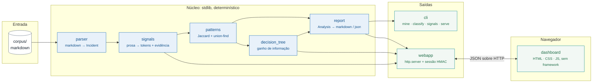

# Componentes e como se conectam

Um diagrama só, de componentes, e o texto que explica cada aresta. Não há C4 nem diagrama
de sequência aqui de propósito: com um pipeline linear e um único processo, aquelas
camadas repetiriam a mesma informação em três níveis de zoom.

## O diagrama

## As arestas, uma por uma

**`corpus → parser`.** O acervo é um diretório de markdown. `parse_corpus` lê cada
arquivo, extrai frontmatter com um parser de subconjunto de YAML próprio (ADR-0001) e
devolve `Incident`. Arquivo sem metadado reconhecível degrada para "sem metadado" em vez
de erro, porque um acervo real tem arquivo torto.

**`parser → signals`.** Cada incidente tem sua prosa varrida por regras de regex que
emitem `Signal(token, kind, evidence)`. O `evidence` é o que mantém tudo auditável: todo
token guarda o trecho original que o produziu. Sem embeddings: ADR-0002 explica por quê.

**`signals → patterns`.** Incidentes viram conjuntos de tokens. Similaridade é Jaccard,
agrupamento é single-linkage por union-find. De cada grupo saem os sinais *distintivos*
(alto suporte dentro, baixo fora) que dão nome ao padrão.

**`patterns → decision_tree`.** Os padrões rotulam os incidentes e a árvore cresce por
ganho de informação sobre presença binária de sinal. Profundidade limitada em quatro:
uma árvore de nove níveis é melhor no papel e inútil com produção parada.

**`patterns → report` e `tree → report`.** `report.analyse` empacota incidentes, padrões,
árvore e cobertura num `Analysis` congelado. É a única estrutura que as saídas consomem.

**`report → cli`.** `mine` escreve markdown e JSON, `classify` percorre a árvore com os
sinais de um incidente ao vivo, `signals` lista a taxonomia.

**`report → webapp`, `tree → webapp`, `signals → webapp`.** O `serve` monta o
`AppState` **uma vez** na subida: parse, análise e taxonomia ficam em memória. O corpus
não muda enquanto o processo vive, e reanalisar por requisição transformaria uma página de
30 ms na página mais o pipeline inteiro.

**`webapp ↔ dashboard`.** JSON sobre HTTP. O navegador chama `/api/summary`,
`/api/patterns`, `/api/matrix`, `/api/tree`, `/api/incidents`, `/api/signals` e
`/api/report` em paralelo depois do login, e `POST /api/classify` quando o usuário marca
sinais. `/api/health` responde sem sessão, porque a sonda do container precisa dela antes
de qualquer login existir.

## O que a direção das setas garante

O núcleo não conhece as saídas. `parser`, `signals`, `patterns`, `decision_tree` e
`report` não importam nada de `cli` nem de `webapp`, e é o que permite o dashboard existir
sem que o caminho da CLI ganhe uma dependência ou um ramo condicional.

Consequência prática: o dashboard não é uma segunda fonte de verdade. A tela de relatório
mostra literalmente a saída de `report.to_markdown`, a mesma que `mine --out` escreve. Se
os dois divergirem, é bug, não decisão de produto.

## Fronteira de confiança

Uma só, e fica no `webapp`: tudo antes dele lê arquivo local e é determinístico; tudo
depois é entrada de rede. Por isso a normalização de payload e a checagem de sessão vivem
ali, e apenas ali. O `Handler` é casca fina justamente para que essa fronteira caiba em
funções puras testáveis sem abrir socket.
